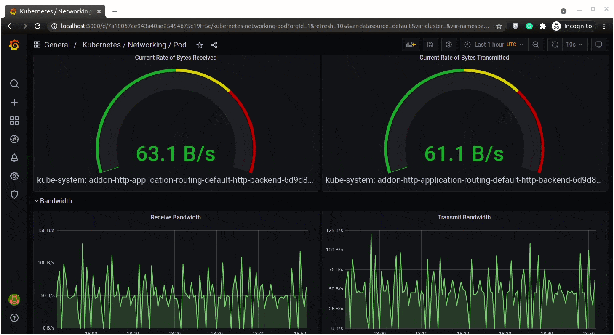
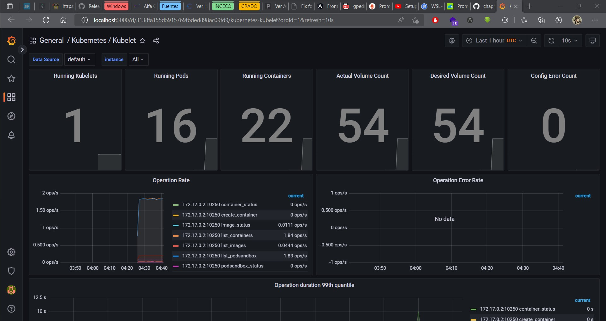

# S3_Monitoring_System


# Reto Ing. Soft 3 2022-1 : Configuración de un sistema de monitoreo

* **Andrés Felipe Rojas**
* **Mario Hernan Vallejo**

## Descripción

Este reto consiste en desplegar un sistema de monitoreo `Prometheus` sobre la infraestructura de Kubernetes, también se debe agregar un sistema de visualización de los recursos monitoreados como `Graphana`. Los recursos para monitorear son por ejemplos consumo de CPU, RAM y Red de los Pods desplegados para el ejemplo de la librería virtual.

## Que es Prometheus?
Prometheus es un conjunto de herramientas de monitoreo y alerta de codigo abierto.
### Componentes
Prometheus se compone de multiples componentes (algunos de ellos opcionales):
* Un servidor principal Prometheus que capta y almacena datos de series temporales.
* Librerias para la instrumentación del codigo de la aplicación.
* Una pasarela PUSH para tareas de corda duración.
* Exportadores que sirven para itegrar servicios como [HaProxy](https://www.haproxy.com/), [StatsD](https://github.com/statsd/statsd), [Graphite](https://github.com/prometheus/graphite_exporter), etc.
* Manejador de alertas para manejar eventos.
* Otras herramientas de soporte.


## Deploy de Prometheus
El despliege de Prometheus se puede realizar usando diferentes metodos, sea bien crear todos los archivos de configuracíón (`.yaml`) y executarlos en el orden correcto, usar un [`operator`](https://kubernetes.io/docs/concepts/extend-kubernetes/operator/) que maneje todos los componentes de Prometheus (deployment manual), usar [Helm](https://helm.sh/) chart para realizar el deploy de un `operator` para Prometheus, etc.

Para este reto el metodo usado fue el de usar [Helm](https://helm.sh/) para realizar el deploy de Prometheus, **Helm charts** es una herramienta sostenida por la comunidad que permite una facil distribución, instalación y mantención de software construido en Kubernetes.

El **Helm chart** usado para el cumplimiento de este reto fue [prometheus](https://artifacthub.io/packages/helm/prometheus-community/prometheus).


### Instalar helm
helm es una herramienta para gestionar aplicaciones de Kubernetes.
```console
snap install helm –classic
```

### Instalar Prometheus
```console
helm repo add prometheus-community https://prometheus-community.github.io/helm-charts

helm repo update

helm install prometheus prometheus-community/kube-prometheus-stack
```

### Grafana
Ahora para poder ver la pagina de dashbaord donde estaran la graficas debemos abrir el puerto de grafana para poder acceder desde el navegador. El puerto del pod es 3000 y la maperemos al 3333.
```console
kubectl port-forward deployment/prometheus-grafana 3333:3000
```

de esta manera podemos ver diferentes graficas para cada tipo de monitoreo.

### Prometheus
Este programa se ejecuta en el puerto 9090, por lo tanto abrimos el puerto para poder visulizarlo.

```console
kubectl port-forward prometheus-prometheus-kube-prometheus-prometheus-0 9090:9090
```


### EXAMPLES
Para las pruebas se desplegaron dos programas, sacados de https://github.com/chaphe/kube-simple/tree/main/nana-sample/simple
```console
kubectl create deployment mongo-depl --image=mongo

kubectl create deployment web-app --image=webapp
```





# REFERENCIAS
https://k21academy.com/docker-kubernetes/prometheus-grafana-monitoring/

https://kubernetes.io/blog/2020/05/21/wsl-docker-kubernetes-on-the-windows-desktop/

https://www.youtube.com/watch?v=QoDqxm7ybLc