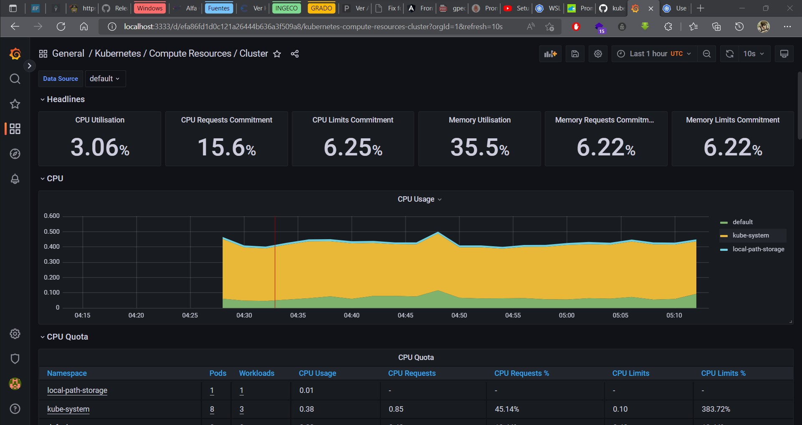

# S3_Monitoring_System


# Instalar helm
helm es una herramienta para gestionar aplicaciones de Kubernetes.
```console
snap install helm –classic
```

# Instalar Prometheus
```console
helm repo add prometheus-community https://prometheus-community.github.io/helm-charts

helm repo update

helm install prometheus prometheus-community/kube-prometheus-stack
```

# Grafana
Ahora para poder ver la pagina de dashbaord donde estaran la graficas debemos abrir el puerto de grafana para poder acceder desde el navegador. El puerto del pod es 3000 y la maperemos al 3333.
```console
kubectl port-forward deployment/prometheus-grafana 3333:3000
```

de esta manera podemos ver diferentes graficas para cada tipo de monitoreo.

# Prometheus
Este programa se ejecuta en el puerto 9090, por lo tanto abrimos el puerto para poder visulizarlo.

```console
kubectl port-forward prometheus-prometheus-kube-prometheus-prometheus-0 9090:9090
```


## EXAMPLES
Para las pruebas se desplegaron dos programas, sacados de https://github.com/chaphe/kube-simple/tree/main/nana-sample/simple
```console
kubectl create deployment mongo-depl --image=mongo

kubectl create deployment web-app --image=webapp
```




# REFERENCIAS
https://k21academy.com/docker-kubernetes/prometheus-grafana-monitoring/

https://kubernetes.io/blog/2020/05/21/wsl-docker-kubernetes-on-the-windows-desktop/

https://www.youtube.com/watch?v=QoDqxm7ybLc